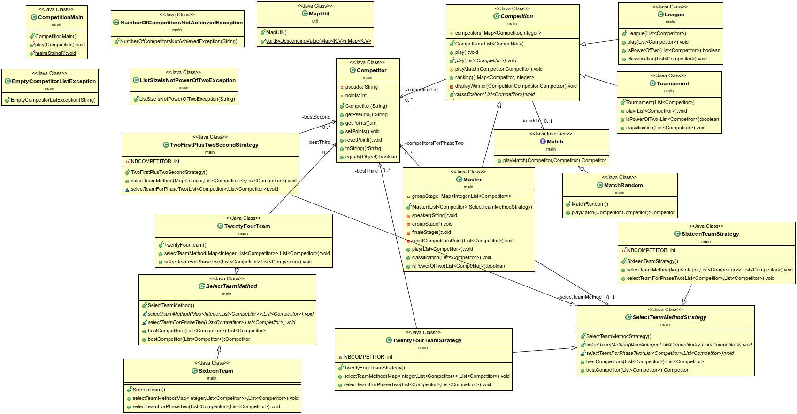

------------------------------------------------------------------------
                                Projet 2 COO
------------------------------------------------------------------------
## PROJECT TITLE:
  compétition

## PURPOSE OF PROJECT:

  Le projet a pour objectif de simuler des matchs avec un choix de compétition
## VERSION or DATE:

  14/11/2021
  

## AUTHORS:

  Adama TRAORÉ

## USER INSTRUCTIONS:

  Récuperation du projet avec la commande :

  * `>>> git clone git@gitlab-etu.fil.univ-lille1.fr:traorea/adama-traore-coo-l3g4-project.git `

  ## Compiler tout le dossier (classes) :

  on se place dans 
  * `>>>cd adama-traore-coo-l3g4-project/version_2`
  puis pour compiler, faites la commande 

 *  `>>> javac -encoding utf8 -d cls -cp cls  main/*.java util/*.java  `

  ## Générer la documentation :
  
   on se place dans 
  * `>>>cd adama-traore-coo-l3g4-project/version_2`

  puis pour compiler, faites la commande 
  
  * `>>> javac  -d doc -cp doc  main/*.java util/*.java`

  ## compiler les tests :
  on se place dans 
  * `>>>cd adama-traore-coo-l3g4-project/version_2`
  puis pour compiler, faites la commande 
 * `>>> javac -encoding utf8 -d cls -cp cls -classpath junit-4.3.jar main/*.java util/*.java test/*.java`

  ## creation du jar

  on se place dans 

  * `>>>cd cls`

  puis faites la commande
  
  * `jar cvmf ../manifest-ex ../master.jar main/*.class util/*.class test/*.class`

  ## Consulter documentation :

Ouvrir le fichier index.html puis pacourir tous les fichiers.

## Lancer le jeu

Placez vous dans le dossier
* `>>>cd adama-traore-coo-l3g4-project/version_2`

puis pour lancer, faites la commande :

 `java -jar  master.jar  typeCompet(M16 ou M24 ou M32) c1 c2 c3 ... ` 
 exemple = `java -jar master.jar  M16  c1 c2 c3 c4 c5 c6 c7 c8 c9 c10 c11 c12 c13 c14 c15 c16` 

                    ou 
  `java -jar  master.jar  typeCompet(L ou T ) c1 c2 c3 ... ` 
  exemple = `java -jar master.jar  L  c1 c2 c3 c4 c5 c6 c7 c8`

## Element de code:
  Mise en pratique des principes SOLID, notamment l'open closed principle sur les types de compétitions et les types de match. Mise en pratique du TDD (Test Drive Development).  Mise en pratique pour la 2ème version du projet, le design pattern strategy

## Remarque :
  Pour l'exécution du projet, j'ai choisi de permettre à l'utilisateur d'entrer sur la ligne de commande le type de compétition (L ou T) ainsi que les noms des Competitors, ce qui m'a valu de faire un switch dans la fonction main, ce qui en effet ne respecte pas l'OCP.
  Pour la dernière stratégie (M32) pas la peine de saisir vu le nombre d'équipes assez conséquent donc juste le paramètre M32 puis Entrez
## Diagramme UML :

